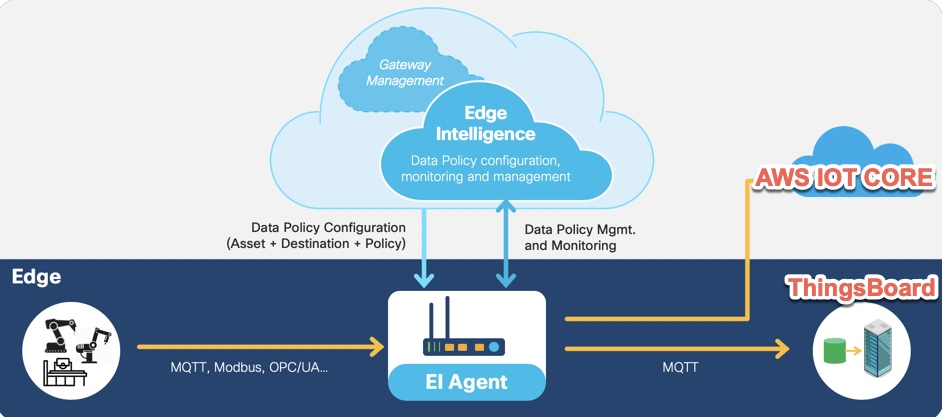

# Cisco Edge Intelligence Sample MQTT scripts

**Cisco Edge Intelligence** (EI) allows to extract, tranform, govern and deliver data from sensor devices to cloud/datacenter applications.

[Cisco Edge Intelligence on DevNet](https://developer.cisco.com/edge-intelligence)

Using standard MQTT destination configuration in EI, data can be forwarded to many destinations like AWS IoT Core, ThingsBoard dashboard etc.

Here is some sample code for receiving MQTT data from Edge Intelligence and re-publishing to AWS IOT Core and ThingsBoard.

### 1. AWS IOT Core : EI-MQTT-AWS.py
* X.509 certifcates based connection to AWS IOT Core
	* Place the X.509 certs in a local folder so, the script can use them.
	* Refer to: `https://aws.amazon.com/premiumsupport/knowledge-center/iot-core-publish-mqtt-messages-python/`
* No change needed to incoming EI MQTT Topic or Message Structure

### 2. Thingsboard Dashboard : EI-MQTT-Thingsboard.py
* Custom Auth Token based authentication
	* Refer to `https://thingsboard.io/docs/getting-started-guides/helloworld/`
* Custom MQTT topic in Thingsboard
* Custom MQTT Message structure in Thingsboard

