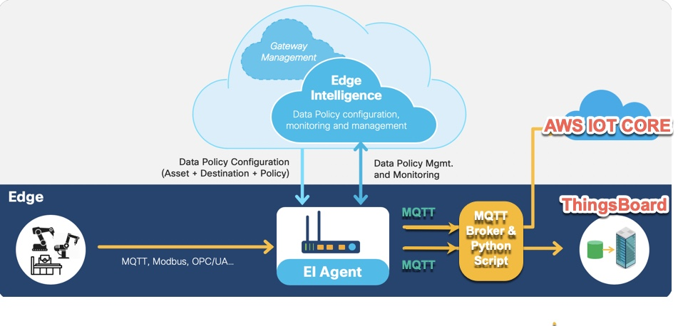

# Cisco Edge Intelligence Sample MQTT scripts

**Cisco Edge Intelligence** (EI) allows to extract, tranform, govern and deliver data from sensor devices to cloud/datacenter applications.

[Cisco Edge Intelligence on DevNet](https://developer.cisco.com/edge-intelligence)

Using standard MQTT destination configuration in EI, data can be forwarded to many destinations like AWS IoT Core, ThingsBoard dashboard etc.

Here is some sample code for receiving MQTT data from Edge Intelligence and re-publishing to AWS IOT Core and ThingsBoard.

### 1. AWS IOT Core : EI-MQTT-AWS.py
* X.509 certifcates based connection to AWS IOT Core
	* Place the X.509 certs in a local folder so, the script can use them.
	* Refer to: `https://aws.amazon.com/premiumsupport/knowledge-center/iot-core-publish-mqtt-messages-python/`
* No change needed to incoming EI MQTT Topic or Message Structure
* Steps to run:
	* Ensure Mosquitto (or any other MQTT Broker) is configured and running.
	* Update script with your AWS IOT Core, RootCA, Cert and Key files, and AWS IOT Core ARN
	* Update script with Local MQTT broker details (hostname/IP Address, port, username & password)
	* The script subscribes to EI MQTT Topic "cisco/edge-intelligence/telemetry/#"
* Sample Output:
	
	Connected to Local MQTT broker
	Subscribed to EI topic

	connect to AWS success

	EI Message received: {"Temperature":{"ts":"2020-04-24T14:14:34.855+00:00","v":0}}

	('EI Topic is: ', u'cisco/edge-intelligence/telemetry/19283746')

	Published to AWS

### 2. Thingsboard Dashboard : EI-MQTT-Thingsboard.py
* Custom Auth Token based authentication
	* Refer to `https://thingsboard.io/docs/getting-started-guides/helloworld/`
* Custom MQTT topic in Thingsboard
* Custom MQTT Message structure in Thingsboard
* Steps to run:
	* Ensure Mosquitto (or any other MQTT Broker) is configured and running.
	* Update script with your Thingsboard instance details (URL, port and Auth Token)
	* Update script with Local MQTT broker details (hostname/IP Address, port, username & password)
	* The script subscribes to EI MQTT Topic "cisco/edge-intelligence/telemetry/#"
	* The script publishes to Thingsboard topic "v1/devices/me/telemetry"
* Sample Output:
	
	Connected to ThingsBoard broker
	Connected to Local MQTT broker
	Subscribed to EI topic

	EI Message received: {"Temperature":{"ts":"2020-04-24T14:14:34.855+00:00","v":0}}

	('EI Topic is: ', u'cisco/edge-intelligence/telemetry/19283746')

	('TB JSON Data is:', '{"Temperature": 66}')

	('Thingsboard Message sent with MID:', 1)
